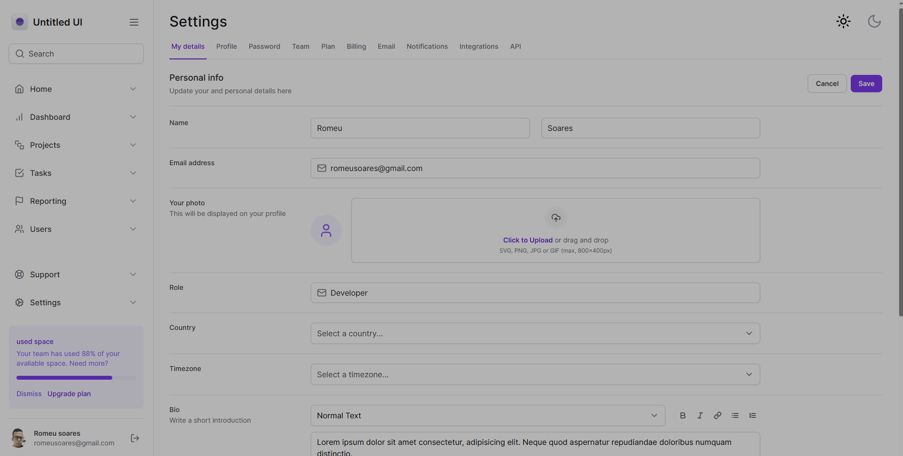
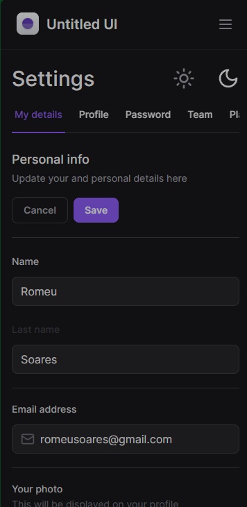

<h1 align='center'> Tailwind Form </h1>

📃 Página dedicado a prática do Tailwindcss, nele criei um formulário responsivo como sidebar e tema dark mode. Cofere no link abaixo.

[Tailwind Form](https://tailwindcss-form-957h.vercel.app)

<h2> 🛠 Principais Tecnologias Utilizadas </h2>

- reactjs
- nextjs
- typescript
- tailwindcss
- next-themes
- radix-ui

<h2 align='center'> Meus contatos </h2>

* [LinkedIn](https://www.linkedin.com/in/romeu-soares-87749a231/)

* romeuindexjs@gmail.com

* WhatsApp: 84 981127596

 

<h3> Autor </h3>

>Romeu soares de souto

<h3> Licença </h3>

